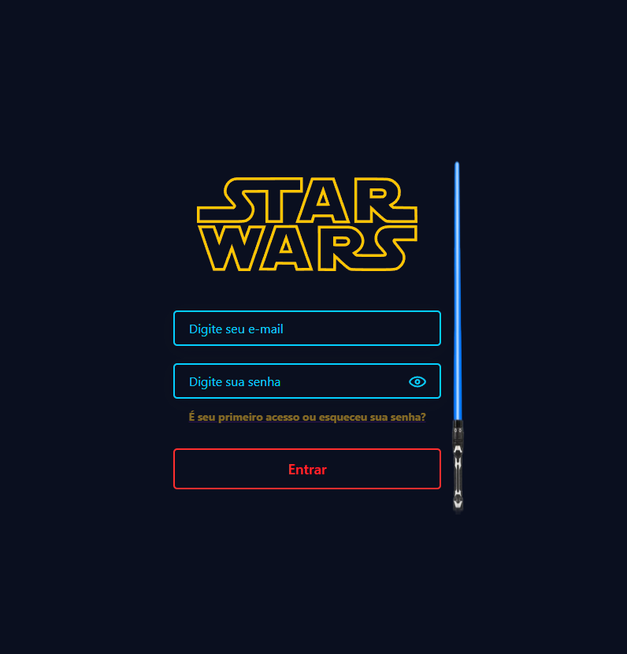
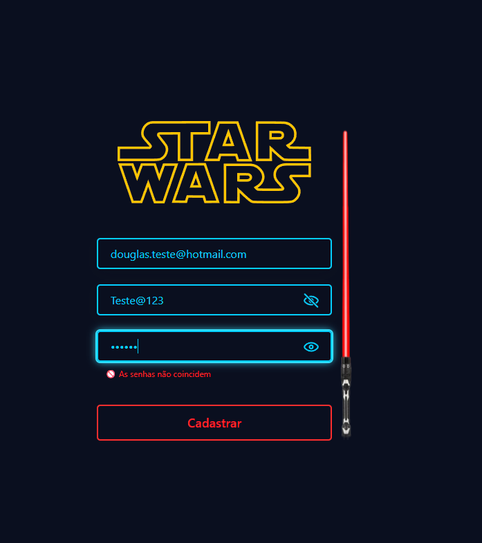
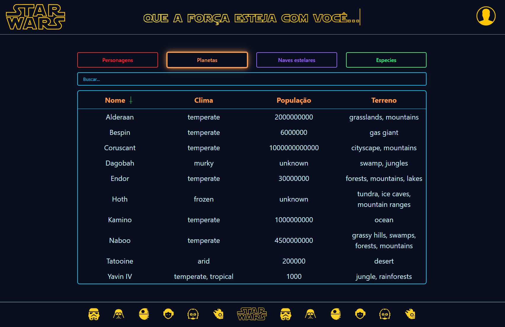
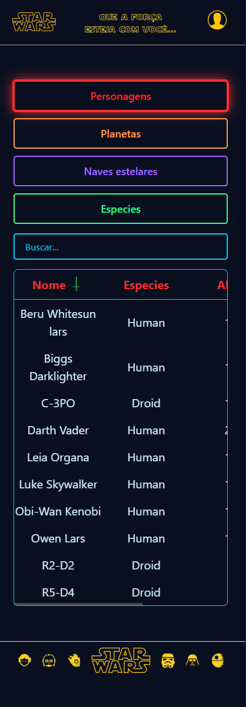

# 💻 Desafio Técnico Front-End - Star Wars

Este projeto consiste em uma aplicação React com sistema de login, cadastro, autenticação simples via `localStorage` e consumo da [API pública do Star Wars](https://swapi.bry.com.br/). A interface exibe dados de naves estelares (Starships) com design temático, responsividade e testes unitários.

---

## 🚀 Como executar

1. **Clone o repositório:**

```bash
git clone https://github.com/Landim013/Project-StarWars.git
cd starwars-desafio
```

2. **Instale as dependências:**

```bash
npm install
```

3. **Execute o projeto:**

```bash
npm run dev
```

4. **Execute os testes unitários:**

```bash
npm run test
```

---

## ✅ Funcionalidades

- Cadastro e login com múltiplos usuários
- Armazenamento seguro no `localStorage`
- Logout sem apagar os dados salvos
- Exclusão de conta individual
- Validação dinâmica de senha
- Tabela com ordenação de dados da API Star Wars
- Responsividade mobile e desktop
- Testes unitários com Jest + Testing Library

---

## 🧠 Regras da senha

- Mínimo de 6 caracteres
- Deve conter ao menos:
  - 1 letra maiúscula
  - 1 letra minúscula
  - 1 número
  - 1 caractere especial (ex: `!@#$%&*`)

---

## 🌌 Dados consumidos da API

A aplicação consome dados da [SWAPI - Star Wars API](https://swapi.bry.com.br//) para exibir informações sobre:

- Naves estelares (`/starships`)
- Personagnes (`/people`)
- Planetas (`/planets`)
- Especies (`/species`)

---

## 📷 Visualização da aplicação

### 💻 Tela de Login



### 🧾 Tela de Cadastro



### 🚀 Dashboard com Starships



### 🚀 Dashboard com Starships Mobile

## 

## 🛠️ Tecnologias utilizadas

- Vite
- React.js
- Styled Components
- React Hook Form
- Axios
- React Router DOM
- Jest
- Testing Library

---

## 💡 Arquitetura

A aplicação foi construída com foco em:

- **Modularidade:** componentes e hooks reutilizáveis
- **Escalabilidade:** regras de negócio desacopladas
- **Responsividade:** design adaptado para mobile e desktop
- **Acessibilidade:** uso de `aria-label` e navegação clara

---

## ✨ Autor

**Douglas Landim**  
[LinkedIn](https://www.linkedin.com/in/douglas-landim/) | [GitHub](https://github.com/Landim013/Landim013)
